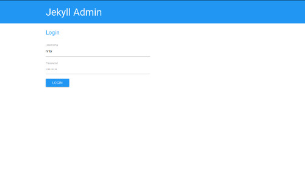
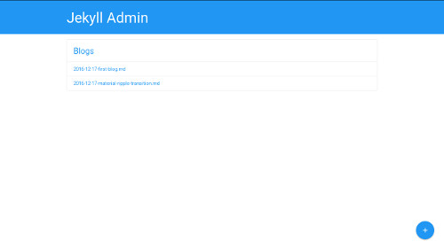
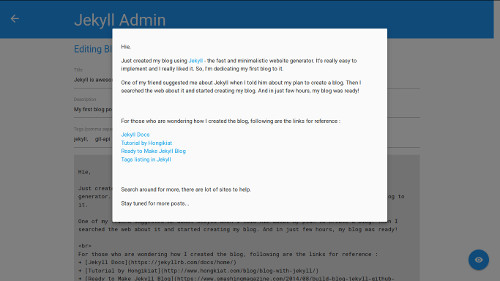

# Jekyll Admin

Jekyll Admin is a handy tool for maintaining Jekyll based blogs. It makes you free from the commands and templates.

Jekyll Admin uses GitHub REST Api v3.

### Usage

+ Fork and Clone the project

```git clone https://github.com/<username>/JekyllAdmin```

+ Edit the `admin_config` file as below:

```
{
	"repo": <your repo name which consists of blog>,
	"path": <path to your blog root, if you blog root is part of some other repo>,
	"branch": <branch where your blog resides, possibly gh-pages>
}
```

+ Create `gh-pages` branch or turn on Github pages on master branch from Settings

+ Goto `https://<username>.github.io/JekyllAdmin` to get started


### Features

+ Login with GitHub credentials



+ View Blog lists



+ Edit or Create Blogs


+ Preview Blog



### Limitations

Currently the Jekyll Admin supports blogs with following template:
```
---
layout: post
title: "Blog Title"
description: "Blog Description."
tags: ["tag1", " tag2"]
---
```

Also, there is no provision to upload files, especially images.

These features may come in future releases.
